# 🏗️ Agave — Comprehensive Repository Guide

> **Agave** is a high-performance Solana validator client written in Rust, maintained by [Anza](https://anza.xyz).
> Current version: **4.2.0-alpha.0** · License: Apache-2.0 · Edition: Rust 2024

---

## Table of Contents

- [What is Agave?](#what-is-agave)
- [High-Level Architecture](#high-level-architecture)
- [Transaction Lifecycle](#transaction-lifecycle)
- [Directory Map — At a Glance](#directory-map--at-a-glance)
- [Core Subsystems (Deep Dive)](#core-subsystems-deep-dive)
  - [validator/](#validator--the-entry-point)
  - [core/](#core--validator-pipeline--services)
  - [runtime/](#runtime--bank--state-management)
  - [svm/](#svm--solana-virtual-machine)
  - [accounts-db/](#accounts-db--account-storage-engine)
  - [ledger/](#ledger--blockstore--shreds)
  - [gossip/](#gossip--cluster-communication)
  - [turbine/](#turbine--block-propagation)
  - [poh/](#poh--proof-of-history)
  - [rpc/](#rpc--json-rpc-api-server)
- [Programs (On-Chain)](#programs-on-chain)
- [Networking & Client Libraries](#networking--client-libraries)
- [CLI & Tools](#cli--tools)
- [Infrastructure & CI](#infrastructure--ci)
- [How Data Flows Through a Validator](#how-data-flows-through-a-validator)
- [Building & Running](#building--running)

---

## What is Agave?

Agave is one of the primary validator clients for the **Solana** blockchain. A **validator** is a node that:

1. **Receives** transactions from users (via RPC or TPU).
2. **Validates** and **orders** them using Proof of History (PoH).
3. **Executes** them against account state in the Solana Virtual Machine (SVM).
4. **Produces blocks** (when elected as leader) and **votes** on other validators' blocks.
5. **Stores** the resulting ledger of blocks and account snapshots.

Agave is a Rust workspace containing **~130 crates** that collectively implement every part of this pipeline.

---

## High-Level Architecture

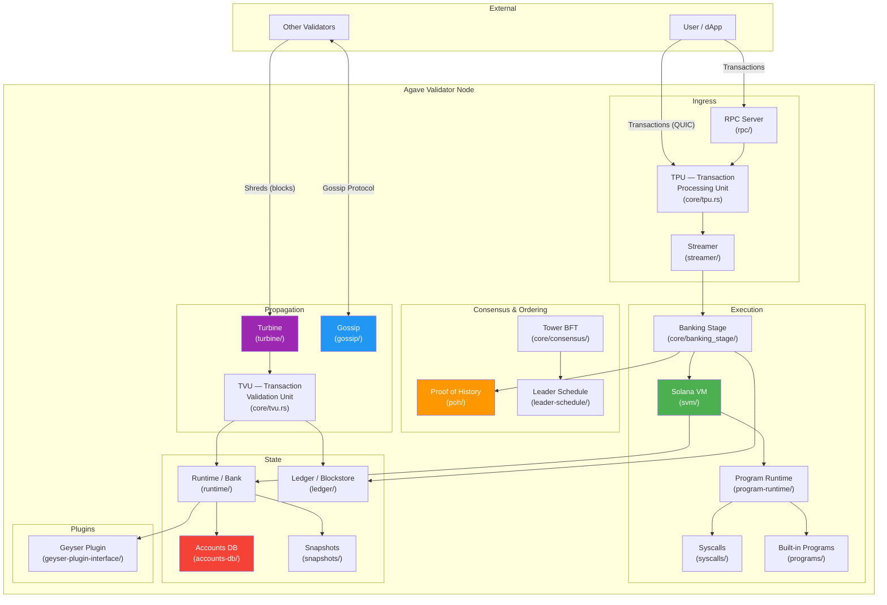

---

## Transaction Lifecycle

This diagram shows what happens when a user submits a transaction:

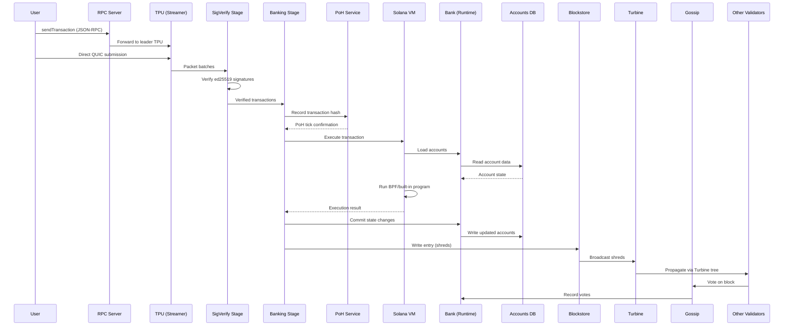

---

## Directory Map — At a Glance

Below is every top-level directory and file in the repository, grouped by function.

### 🟢 Core Validator Pipeline

| Directory | Purpose |
|-----------|---------|
| `validator/` | Binary entry point — CLI parsing, process bootstrap, admin RPC |
| `core/` | Main validator services: TPU, TVU, Banking Stage, Replay Stage, Consensus |
| `runtime/` | The "Bank" — in-memory state of the blockchain at a given slot |
| `svm/` | Solana Virtual Machine — transaction execution engine |
| `program-runtime/` | BPF/SBF program loader, invoke context, CPI, memory management |
| `syscalls/` | Host functions exposed to on-chain programs (sol_log, sol_invoke, etc.) |

### 🔵 Networking & Communication

| Directory | Purpose |
|-----------|---------|
| `gossip/` | Cluster discovery, protocol messages (CRDS), push/pull protocol |
| `turbine/` | Block propagation — broadcast & retransmit stages using Turbine tree |
| `streamer/` | Low-level UDP/QUIC packet I/O, `recvmmsg`/`sendmmsg` |
| `quic-client/` | QUIC-based client for sending transactions to TPU |
| `udp-client/` | Legacy UDP-based client for sending transactions |
| `connection-cache/` | Connection pooling for TPU client connections |
| `tpu-client/` | High-level TPU client with leader tracking |
| `tpu-client-next/` | Next-gen TPU client implementation |
| `net-utils/` | Network utilities (port binding, IP resolution) |
| `tls-utils/` | TLS certificate utilities |
| `xdp/` | Linux XDP (eXpress Data Path) fast packet processing |
| `xdp-ebpf/` | eBPF programs for XDP packet filtering |

### 🟡 State & Storage

| Directory | Purpose |
|-----------|---------|
| `accounts-db/` | On-disk account storage (AppendVec), indexing, caching, compaction |
| `ledger/` | Blockstore (RocksDB), shred management, block processing |
| `ledger-tool/` | CLI tool for inspecting and repairing the ledger |
| `snapshots/` | Snapshot types, hashing, serialization |
| `bucket_map/` | Memory-mapped hash map for accounts index |
| `storage-bigtable/` | Google Bigtable storage backend for historical data |
| `storage-proto/` | Protobuf definitions for storage serialization |

### 🟣 On-Chain Programs

| Directory | Purpose |
|-----------|---------|
| `programs/system/` | System Program — account creation, SOL transfers |
| `programs/vote/` | Vote Program — validator vote accounts and tower |
| `programs/bpf_loader/` | BPF Loader — deploys and executes on-chain programs |
| `programs/compute-budget/` | Compute Budget Program — set CU limits and fees |
| `programs/zk-elgamal-proof/` | ZK ElGamal proof verification program |
| `programs/zk-token-proof/` | ZK Token proof verification program |
| `programs/sbf/` | Test programs compiled to SBF for integration testing |
| `builtins/` | Registry of all built-in (native) programs |
| `builtins-default-costs/` | Default compute costs for built-in programs |
| `precompiles/` | Precompiled programs (ed25519, secp256k1 verify) |

### 🟠 Client & CLI

| Directory | Purpose |
|-----------|---------|
| `cli/` | `solana` command-line tool (transfer, stake, deploy, etc.) |
| `cli-config/` | CLI configuration file management (~/.config/solana/) |
| `cli-output/` | Formatted output for CLI (tables, JSON) |
| `clap-utils/` | CLI argument parsing helpers (clap v2) |
| `clap-v3-utils/` | CLI argument parsing helpers (clap v3) |
| `client/` | Unified Solana RPC client |
| `rpc-client/` | JSON-RPC HTTP client |
| `rpc-client-api/` | RPC request/response types |
| `rpc-client-types/` | Shared RPC client types |
| `rpc-client-nonce-utils/` | Nonce account utilities for durable transactions |
| `pubsub-client/` | WebSocket pub/sub client |
| `remote-wallet/` | Hardware wallet support (Ledger, Trezor) |

### 🔴 RPC Server

| Directory | Purpose |
|-----------|---------|
| `rpc/` | Full JSON-RPC API server (`getBalance`, `sendTransaction`, etc.) |
| `rpc-test/` | Integration tests for the RPC server |

### 🟤 Consensus & Voting

| Directory | Purpose |
|-----------|---------|
| `vote/` | Vote state parsing and management |
| `votor/` | Automated vote submission service |
| `votor-messages/` | Message types for the votor service |

### ⚪ Supporting Utilities

| Directory | Purpose |
|-----------|---------|
| `bloom/` | Bloom filter implementation |
| `bls-cert-verify/` | BLS certificate verification |
| `bls-sigverify/` | BLS signature verification |
| `compute-budget/` | Compute budget processing logic |
| `compute-budget-instruction/` | Compute budget instruction parsing |
| `cost-model/` | Transaction cost estimation |
| `cpu-utils/` | CPU core affinity and pinning utilities |
| `download-utils/` | File download with progress bars |
| `entry/` | Ledger entries — bundles of transactions with PoH hashes |
| `faucet/` | SOL faucet server for devnet/testnet |
| `faucet-cli/` | Faucet CLI client |
| `feature-set/` | Feature gate flags for runtime upgrades |
| `fee/` | Fee calculation logic |
| `fs/` | Filesystem utilities |
| `genesis/` | Genesis block creation tool |
| `genesis-utils/` | Genesis configuration utilities |
| `io-uring/` | Linux io_uring async I/O wrapper |
| `keygen/` | Keypair generation tool |
| `lattice-hash/` | Lattice-based hashing for accounts |
| `leader-schedule/` | Leader schedule computation |
| `logger/` | Logging configuration |
| `math-utils/` | Math utility functions |
| `measure/` | Performance measurement macros |
| `merkle-tree/` | Merkle tree implementation |
| `metrics/` | InfluxDB metrics reporting |
| `notifier/` | Slack/Discord notification service |
| `perf/` | Performance utilities (CUDA sigverify, packet recycling) |
| `random/` | Randomness utilities |
| `rayon-threadlimit/` | Thread pool size limiting |
| `reserved-account-keys/` | List of reserved Solana account addresses |
| `runtime-transaction/` | Transaction wrapping for runtime processing |
| `scheduler-bindings/` | IPC bindings for external scheduler |
| `scheduling-utils/` | Transaction scheduling utilities |
| `send-transaction-service/` | Background transaction retry service |
| `transaction-context/` | Transaction execution context (accounts, return data) |
| `transaction-status/` | Transaction status and metadata types |
| `transaction-status-client-types/` | Client-facing transaction status types |
| `transaction-view/` | Zero-copy transaction parsing |
| `unified-scheduler-logic/` | Core logic for the unified scheduler |
| `unified-scheduler-pool/` | Thread pool for the unified scheduler |
| `version/` | Validator version reporting |

### ⚫ Plugin System

| Directory | Purpose |
|-----------|---------|
| `geyser-plugin-interface/` | Plugin trait for streaming account/transaction data |
| `geyser-plugin-manager/` | Dynamic library loading and lifecycle management for Geyser plugins |

### 🔧 Testing & Benchmarking

| Directory | Purpose |
|-----------|---------|
| `test-validator/` | In-process test validator for development |
| `program-test/` | Framework for testing on-chain programs |
| `local-cluster/` | Spin up multi-node clusters for integration tests |
| `client-test/` | Client integration tests |
| `accounts-cluster-bench/` | Accounts DB benchmarking tool |
| `poh-bench/` | Proof of History benchmarking |
| `rbpf-cli/` | CLI for running/debugging SBF programs |
| `dev-bins/` | Development helper binaries |

### 📁 Build, CI & Scripts

| Directory | Purpose |
|-----------|---------|
| `ci/` | CI pipeline scripts (Buildkite, Docker, testing) |
| `scripts/` | Build, release, metric, and maintenance scripts |
| `net/` | Network deployment scripts (GCE, SSH, multi-node setup) |
| `multinode-demo/` | Scripts to run a local multi-validator testnet |
| `docs/` | Documentation sources |
| `.buildkite/` | Buildkite CI pipeline definitions |
| `.github/` | GitHub Actions workflows |
| `.cargo/` | Cargo configuration (patch overrides) |
| `.config/` | Test runner (nextest) configuration |

### 📄 Root Config Files

| File | Purpose |
|------|---------|
| `Cargo.toml` | Workspace manifest — lists all 130+ member crates and shared dependencies |
| `Cargo.lock` | Locked dependency versions |
| `rust-toolchain.toml` | Pins the Rust compiler version |
| `rustfmt.toml` | Code formatting rules |
| `clippy.toml` | Clippy lint configuration |
| `LICENSE` | Apache 2.0 license |
| `README.md` | Original build/test instructions |
| `CONTRIBUTING.md` | Contribution guidelines |
| `CHANGELOG.md` | Release changelog |
| `RELEASE.md` | Release process documentation |
| `SECURITY.md` | Security policy and vulnerability reporting |
| `.codecov.yml` | Code coverage configuration |
| `.mergify.yml` | Mergify auto-merge rules |
| `vercel.json` | Vercel deployment config (for docs) |
| `cargo` | Wrapper script that invokes cargo with workspace settings |
| `cargo-build-sbf` | Shortcut to build SBF on-chain programs |
| `cargo-test-sbf` | Shortcut to test SBF on-chain programs |
| `fetch-spl.sh` | Downloads SPL program binaries |
| `fetch-programs.sh` | Downloads program binaries |
| `fetch-core-bpf.sh` | Downloads core BPF program binaries |

---

## Core Subsystems (Deep Dive)

### `validator/` — The Entry Point

The validator binary is where everything starts.

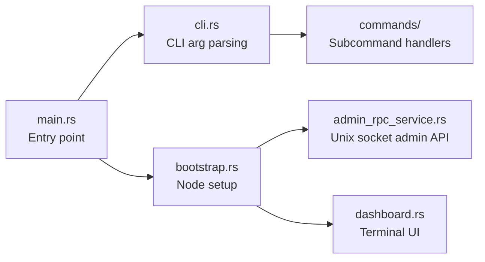

**Key files:**
| File | Purpose |
|------|---------|
| `src/main.rs` | Process entry — parses args and starts the validator |
| `src/cli.rs` | Defines all CLI arguments (identity, RPC port, ledger path, etc.) |
| `src/bootstrap.rs` | Downloads snapshots, catches up with the cluster, bootstraps the node |
| `src/admin_rpc_service.rs` | Admin RPC (Unix socket) for live validator management |
| `src/dashboard.rs` | Live terminal dashboard showing validator health |

---

### `core/` — Validator Pipeline & Services

The **heart** of the validator. Contains the two main processing units (TPU and TVU) and all major pipeline stages.

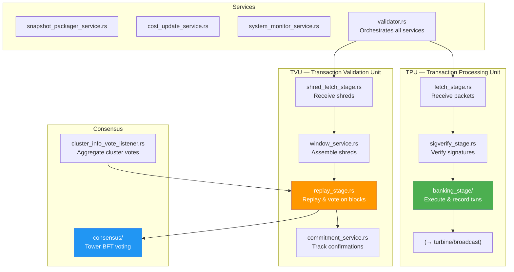

**Key files (41 source files, 8 subdirectories):**

| File | Purpose |
|------|---------|
| `validator.rs` (149 KB) | Master orchestrator — starts all services, manages lifecycle |
| `tpu.rs` | Constructs the Transaction Processing Unit pipeline |
| `tvu.rs` | Constructs the Transaction Validation Unit pipeline |
| `banking_stage.rs` | Receives verified txns, executes them, records in PoH |
| `banking_stage/` | Sub-modules: scheduling, forwarding, decision-making |
| `replay_stage.rs` (237 KB) | Replays blocks from other leaders, manages forks, triggers votes |
| `consensus.rs` (159 KB) | Tower BFT implementation — vote selection, fork choice |
| `consensus/` | Sub-modules: fork choice, progress tracking, heaviest subtree |
| `fetch_stage.rs` | Receives raw packets from network |
| `sigverify_stage.rs` | GPU/CPU signature verification pipeline |
| `forwarding_stage.rs` | Forwards txns to the current leader (if not leader) |
| `cluster_info_vote_listener.rs` | Aggregates votes from gossip |
| `commitment_service.rs` | Tracks block confirmation levels |
| `window_service.rs` | Manages the repair/shred window |
| `repair/` | Repair protocol: request missing shreds from peers |
| `block_creation_loop.rs` | Entry creation and tick generation |
| `snapshot_packager_service.rs` | Packages full/incremental snapshots |
| `system_monitor_service.rs` | Monitors CPU, memory, disk, network stats |

---

### `runtime/` — Bank & State Management

The **Bank** is Agave's central state abstraction — it represents the complete state of the blockchain at a single slot.

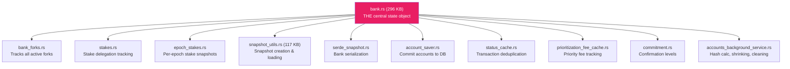

**Key files (44 source files, 8 subdirectories):**

| File | Purpose |
|------|---------|
| `bank.rs` (296 KB) | The Bank — loads/stores accounts, processes transactions, manages epoch boundaries |
| `bank/` | Sub-modules for fee collection, rewards, builtins, sysvar updates |
| `bank_forks.rs` | Tracks the tree of all active bank forks |
| `snapshot_utils.rs` (117 KB) | Full & incremental snapshot creation, archival, loading |
| `snapshot_bank_utils.rs` (104 KB) | Bank-specific snapshot helpers |
| `stakes.rs` | Tracks all stake accounts and vote accounts |
| `epoch_stakes.rs` | Epoch-scoped stake weight snapshots |
| `accounts_background_service.rs` | Background tasks: hash calculations, account shrinking, cleaning |
| `serde_snapshot.rs` | Serialize/deserialize bank state for snapshots |
| `status_cache.rs` | Deduplicates recently processed transactions |
| `installed_scheduler_pool.rs` | Interface for pluggable transaction schedulers |
| `block_component_processor.rs` | Processes block components (entries, rewards, state roots) |

---

### `svm/` — Solana Virtual Machine

The **SVM** is the execution engine. It loads accounts, runs programs, and produces execution results.

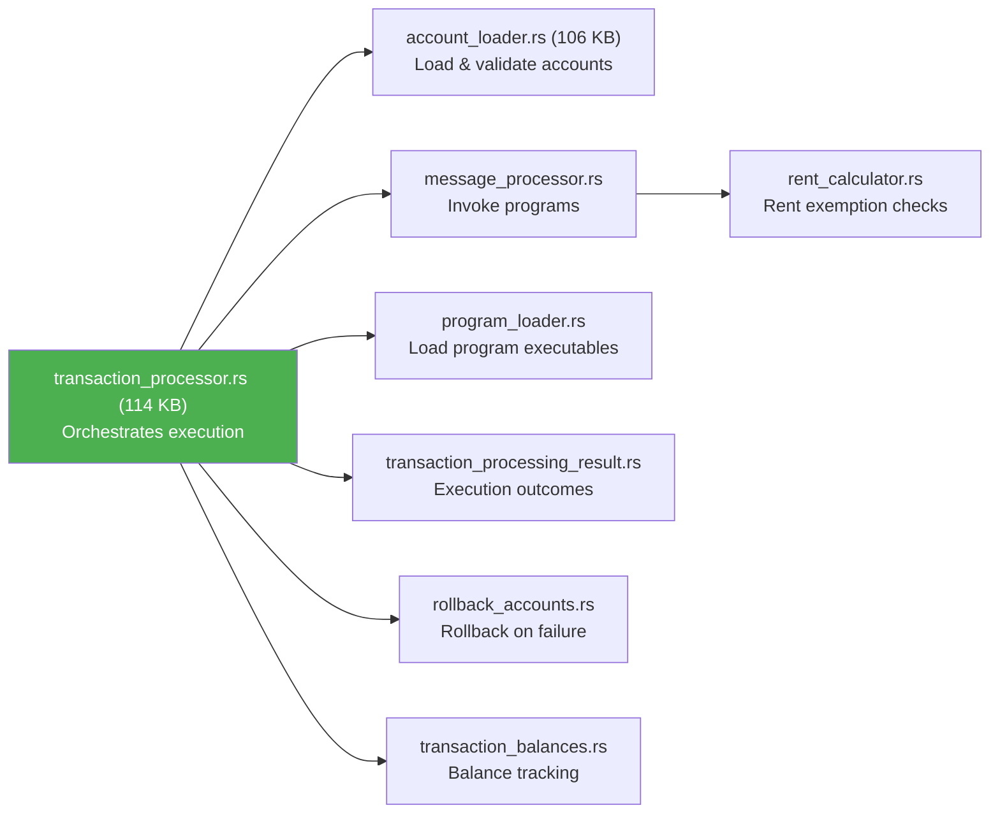

**Key files (16 source files):**

| File | Purpose |
|------|---------|
| `transaction_processor.rs` (114 KB) | The main transaction processing pipeline |
| `account_loader.rs` (106 KB) | Loads accounts, validates signatures, checks balances |
| `message_processor.rs` | Calls into program runtime to execute instructions |
| `program_loader.rs` | Loads BPF executables from accounts |
| `rollback_accounts.rs` | Rolls back account state on transaction failure |
| `nonce_info.rs` | Durable nonce handling for offline transactions |
| `transaction_error_metrics.rs` | Error categorization and counting |

**SVM Support Crates:**

| Crate | Purpose |
|-------|---------|
| `svm-callback/` | Callbacks from SVM to the runtime environment |
| `svm-feature-set/` | Feature flags specific to the SVM |
| `svm-log-collector/` | Captures program log output |
| `svm-measure/` | Timing measurements for SVM operations |
| `svm-timings/` | Execution timing breakdown |
| `svm-type-overrides/` | Type overrides for testing/conformance |

---

### `accounts-db/` — Account Storage Engine

The on-disk database for all Solana accounts. Uses append-only storage files and a sophisticated indexing system.

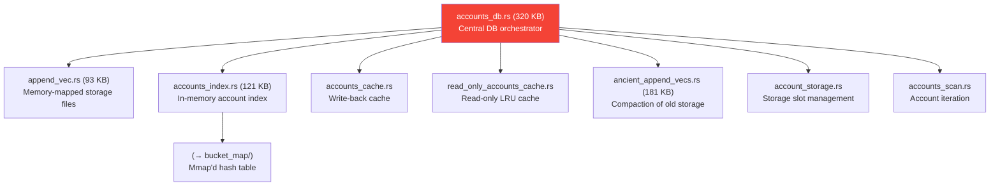

**Key files (32 source files, 5 subdirectories):**

| File | Purpose |
|------|---------|
| `accounts_db.rs` (320 KB) | Master accounts database — storage, indexing, hashing, cleaning |
| `ancient_append_vecs.rs` (181 KB) | Compacts old append vecs into consolidated storage |
| `accounts_index.rs` (121 KB) | In-memory index mapping pubkey → storage location |
| `append_vec.rs` (93 KB) | Memory-mapped append-only account storage files |
| `accounts.rs` | High-level account access API |
| `accounts_cache.rs` | Write-through cache for recently modified accounts |
| `read_only_accounts_cache.rs` | LRU cache for frequently read accounts |
| `rolling_bit_field.rs` | Compact bitfield for slot tracking |
| `blockhash_queue.rs` | Recent blockhash management |
| `storable_accounts.rs` | Trait for batch account writes |

---

### `ledger/` — Blockstore & Shreds

The ledger stores the chain's blocks as **shreds** (small erasure-coded pieces) in a RocksDB-backed **Blockstore**.

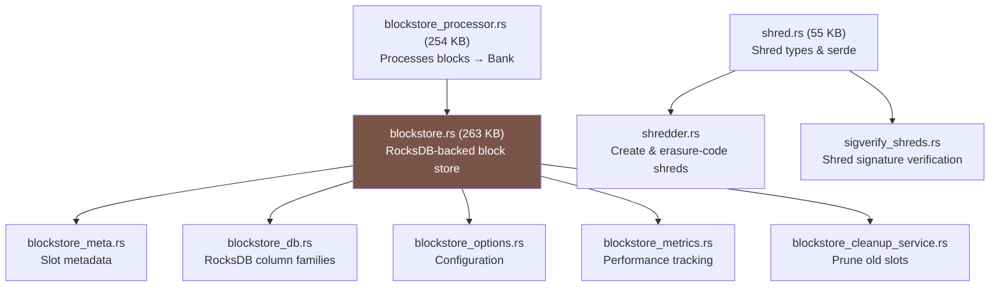

**Key files (32 source files, 2 subdirectories):**

| File | Purpose |
|------|---------|
| `blockstore.rs` (263 KB) | Core block storage: insert shreds, query slots, manage forks |
| `blockstore_processor.rs` (254 KB) | Processes entries from blockstore → execute in Bank |
| `shred.rs` (55 KB) | Shred data structures (data shreds, coding shreds) |
| `blockstore_db.rs` | RocksDB abstraction (column families, iterators) |
| `blockstore_meta.rs` | Slot metadata (completion status, parent, shred counts) |
| `shredder.rs` | Creates shreds from entries, applies Reed-Solomon erasure coding |
| `sigverify_shreds.rs` | Verifies shred leader signatures |
| `leader_schedule_cache.rs` | Caches the leader schedule for shred verification |
| `bank_forks_utils.rs` | Loads bank forks from blockstore at startup |

---

### `gossip/` — Cluster Communication

Gossip is how validators discover each other, share metadata, and propagate votes.

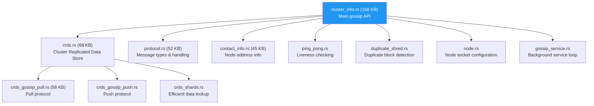

**Key files (33 source files):**

| File | Purpose |
|------|---------|
| `cluster_info.rs` (158 KB) | High-level gossip API — push/pull data, vote propagation |
| `crds.rs` (68 KB) | CRDS table — stores all gossip values with versioning |
| `crds_gossip_pull.rs` (58 KB) | Pull protocol — request data from random peers |
| `protocol.rs` (52 KB) | Network message types (Ping, Pong, PullRequest, PushMessage) |
| `contact_info.rs` (45 KB) | Validator contact info (IP, ports, shred version) |
| `crds_data.rs` | CRDS data types (ContactInfo, Vote, EpochSlots, etc.) |
| `crds_gossip_push.rs` | Push protocol — actively broadcast updates |
| `weighted_shuffle.rs` | Stake-weighted random peer selection |
| `duplicate_shred.rs` | Detects and reports leaders producing duplicate blocks |
| `epoch_slots.rs` | Compressed representation of which slots a validator has |

---

### `turbine/` — Block Propagation

Turbine disseminates blocks across the cluster using a tree topology for O(log n) propagation.

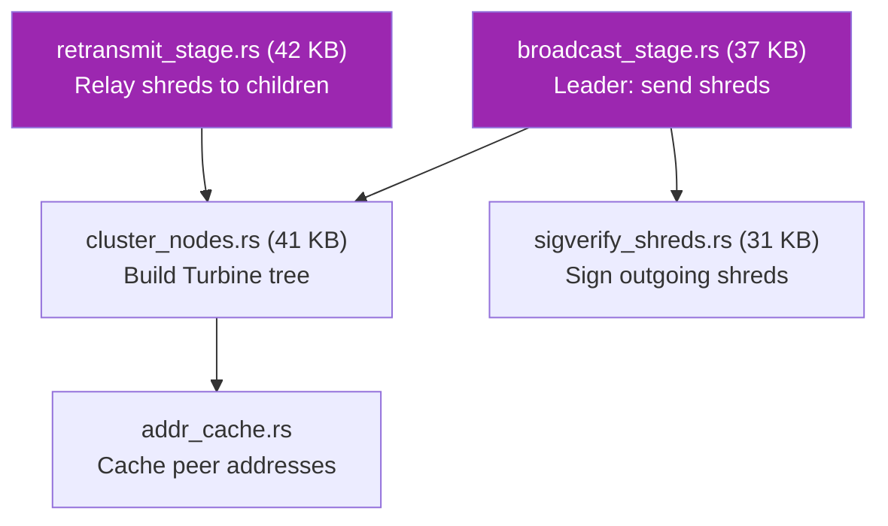

---

### `poh/` — Proof of History

PoH is Solana's clock — a continuously running SHA-256 hash chain that orders events.

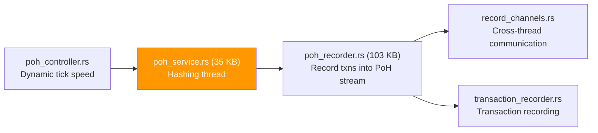

---

### `rpc/` — JSON-RPC API Server

The RPC server exposes the Solana JSON-RPC API to clients and dApps.

**Key files (18 source files):**

| File | Purpose |
|------|---------|
| `rpc.rs` (391 KB) | All RPC method implementations (`getBalance`, `getBlock`, `sendTransaction`, etc.) |
| `rpc_service.rs` | HTTP server setup and request routing |
| `rpc_pubsub.rs` | WebSocket pub/sub API (`accountSubscribe`, `slotSubscribe`) |
| `rpc_pubsub_service.rs` | WebSocket server lifecycle |
| `rpc_subscriptions.rs` (124 KB) | Subscription management and notification dispatch |
| `rpc_subscription_tracker.rs` | Tracks active subscriptions |
| `transaction_status_service.rs` | Writes transaction status to blockstore |
| `rpc_health.rs` | Health check endpoint |

---

## Programs (On-Chain)

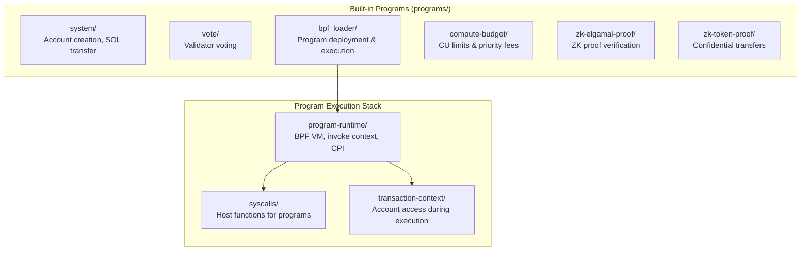

### `program-runtime/` Key Files

| File | Purpose |
|------|---------|
| `invoke_context.rs` (82 KB) | The context passed to every program invocation |
| `loaded_programs.rs` (105 KB) | Program cache — JIT-compiled BPF programs |
| `cpi.rs` (96 KB) | Cross-Program Invocation logic |
| `serialization.rs` (67 KB) | Serialize account data for the BPF VM |
| `vm.rs` | BPF virtual machine integration |
| `execution_budget.rs` | Compute unit budget management |
| `mem_pool.rs` | Memory pool for program execution |
| `sysvar_cache.rs` | Cached sysvar values for programs |

---

## Networking & Client Libraries

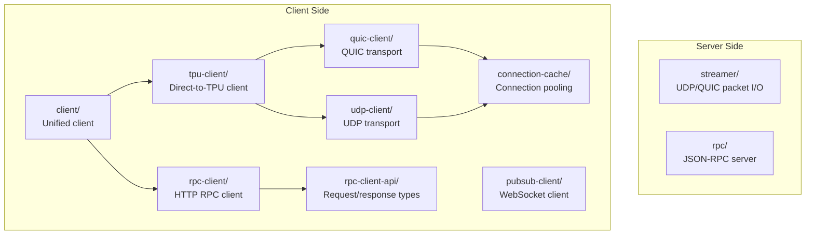

---

## CLI & Tools

### `cli/` — The `solana` Command Line Tool

The main user-facing tool for interacting with a Solana cluster.

| File | Purpose |
|------|---------|
| `main.rs` | Entry point and subcommand dispatch |
| `cli.rs` (104 KB) | Core CLI logic and command processing |
| `wallet.rs` | Airdrop, transfer, balance commands |
| `stake.rs` (212 KB) | Stake account management (delegate, deactivate, split, etc.) |
| `vote.rs` (122 KB) | Vote account management |
| `program.rs` (183 KB) | Program deployment, upgrade, and management |
| `cluster_query.rs` (87 KB) | Cluster info queries (validators, epoch, block production) |
| `feature.rs` | Feature gate activation |
| `nonce.rs` | Durable nonce account management |
| `address_lookup_table.rs` | ALT creation and management |

### Other Tools

| Tool | Purpose |
|------|---------|
| `keygen/` | `solana-keygen` — generate, recover, verify keypairs |
| `ledger-tool/` | `solana-ledger-tool` — inspect, verify, repair the blockstore |
| `install/` | `solana-install` — install and manage validator software |
| `watchtower/` | `solana-watchtower` — monitor validator health, send alerts |
| `tokens/` | `solana-tokens` — bulk token distribution |
| `stake-accounts/` | Stake account management utilities |
| `test-validator/` | `solana-test-validator` — local single-node cluster for development |
| `faucet/` / `faucet-cli/` | SOL faucet for devnet/testnet |
| `gossip-cli/` | Spy on gossip network traffic |
| `rbpf-cli/` | Debug on-chain programs locally |

---

## Infrastructure & CI

### `ci/` — Continuous Integration

| Path | Purpose |
|------|---------|
| `ci/buildkite-secondary.yml` | Secondary Buildkite pipeline |
| `ci/test-stable.sh` | Main stable test runner |
| `ci/test-checks.sh` | Linting and formatting checks |
| `ci/docker/` | Docker images for CI |
| `ci/do-audit.sh` | Security audit of dependencies |
| `ci/localnet-sanity.sh` | Local network sanity tests |
| `ci/order-crates-for-publishing.py` | Determines crate publish order |

### `scripts/` — Build & Release Scripts

| Script | Purpose |
|--------|---------|
| `cargo-install-all.sh` | Builds and installs all validator binaries |
| `create-release-tarball.sh` | Packages release artifacts |
| `coverage.sh` | Generate code coverage reports |
| `increment-cargo-version.sh` | Bump version numbers across all crates |
| `patch-crates.sh` | Apply dependency patches |

### `net/` — Network Deployment

| Script | Purpose |
|--------|---------|
| `net.sh` (37 KB) | Master script for deploying validator clusters |
| `gce.sh` (29 KB) | Google Compute Engine provisioning |
| `remote/` | Scripts executed on remote machines |
| `scripts/` | Network helper scripts |

### `multinode-demo/` — Local Testnet

| Script | Purpose |
|--------|---------|
| `bootstrap-validator.sh` | Start the bootstrap (genesis) validator |
| `validator.sh` | Start additional validators |
| `faucet.sh` | Start the faucet |
| `setup.sh` | Generate genesis config |

---

## How Data Flows Through a Validator

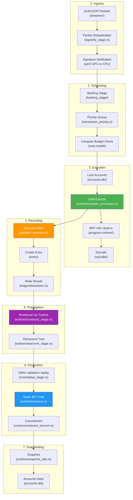

---

## Building & Running

### Prerequisites

```bash
# Install Rust
curl https://sh.rustup.rs -sSf | sh
source $HOME/.cargo/env
rustup component add rustfmt

# Ubuntu dependencies
sudo apt-get install libssl-dev libudev-dev pkg-config zlib1g-dev \
  llvm clang cmake make libprotobuf-dev protobuf-compiler libclang-dev
```

### Build

```bash
git clone https://github.com/anza-xyz/agave.git
cd agave
./cargo build           # Debug build
./cargo build --release # Release build (for production)
```

### Test

```bash
./cargo nextest run --profile ci --cargo-profile ci --config-file .config/nextest.toml
```

### Run Local Testnet

```bash
# Terminal 1: Start bootstrap validator
./multinode-demo/setup.sh
./multinode-demo/faucet.sh
./multinode-demo/bootstrap-validator.sh

# Terminal 2: Start additional validator
./multinode-demo/validator.sh
```

### Run Test Validator (for development)

```bash
cargo run --bin solana-test-validator
```

---

## Crate Dependency Graph (Simplified)

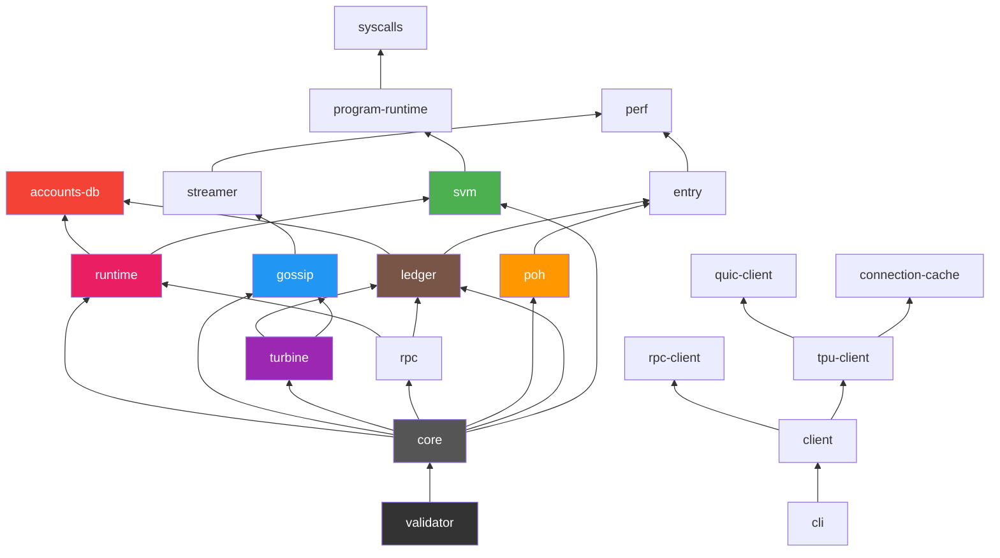

---

> **Generated for**: Understanding the Agave (Solana Validator) repository structure
> **Repository**: https://github.com/anza-xyz/agave
> **Version**: 4.2.0-alpha.0
